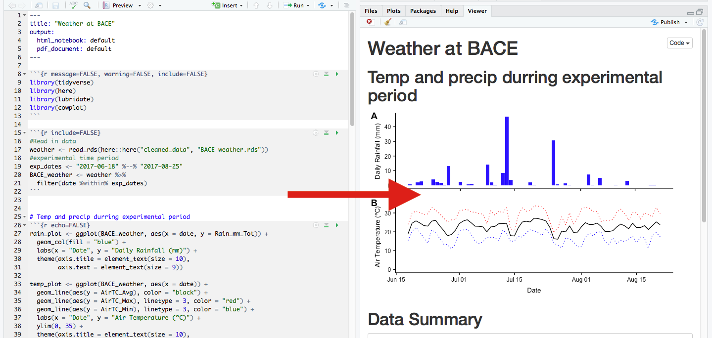
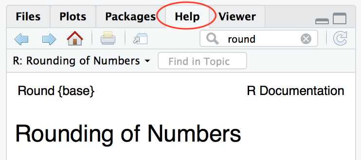

## Information

Office Hours:

- Avalon: **Friday 1:30--2:30 pm** in SEC 300H8
- Eric: **Monday 2--3 pm** in SEC 300H8

## Objectives

- Learn to work with, explore, visualize, and analyze data
- Learn tools you'll need to complete homework assignments
- Practice lecture concepts
- Learn how to find resources to get help with R

## Expectations

- **Attendance** (Recitation is required)
- **Collaboration** 
    - Ask for help from your classmates
    - Ask your classmates if they need help
- **Experiment, play, and have fun with R!**
- **Tell us if we need to slow down!**

## Suggested additional readings

- *Modern Dive* chapters 2--5 ([moderndive.com](https://moderndive.com/))
- *R for Data Science* section I. Explore ([r4ds.had.co.nz](http://r4ds.had.co.nz/explore-intro.html))

## Why R?

- Open source (free!)
- Vibrant, helpful, friendly community online
- Reproducibility of code vs. point-and-click
- Used in biology research, statistics, data science, and other STEM careers

## What is R? What is R Studio?

R is a programing language, but it's one that's designed to work interactively.

```{r}
x <- 25
```

That means I can run one line of code at a time, instead of having to write a whole *program*.

```{r}
x^2
```

This makes it easy to learn and debug


## What is R? What is R Studio?

R Studio is an integrated development environment, or IDE.  Think of R as a car's engine and RStudio as the car's dashboard.

R: Engine            |  RStudio: Dashboard 
:-------------------------:|:-------------------------:
  |  


In this class we will always interact with R through RStudio, never directly.

## Tour of RStudio

Launch RStudio


Launch RStudio            |  **NOT** R 
:-------------------------:|:-------------------------:
  |  


# Review of [DataCamp](https://www.datacamp.com/courses/free-introduction-to-r) Lesson

## R as a calculator

```{r results='hold'}
5+5
10^10
```

## Variable Assignment

```{r results="hold"}
x <- 2
y <- 3
x + y
```

```{r results="hold"}
z <- "Hello"
z
```

## Functions

```{r results="hold"}
sqrt(25)
abs(-5)
round(1.522222, digits = 3)
```

## Commenting your code

Use "#" to add notes in your code
```{r}
x <- c(1, 3, 7) 
#the 'c()' function concatenates elements into a vector
x
mean(x) #this takes the mean of 'x'
```

# Extending R

## Packages

- Packages extend the capabilities of R
- Think of them like apps for a smartphone
- For example, the `abd` package contains all the datasets used in your textbook
- We will use `abd`, `ggplot2`, and `dplyr` heavily in this course

```{r echo=FALSE, out.width="20%"}
knitr::include_graphics(c("figs/dplyr.png", "figs/ggplot2.png"))
```


## Install Packages
- Install R packages using the "Packages" tab in RStudio
- Install `abd` and `ggplot2` now
    + Packages only need to be installed **once**
- Load packages with `library(<<package name>>)`
    + Packages need to be loaded **once per R session**

# Exploring Data

## Example Dataset

- Today we'll be using a built-in dataset called `iris`
- What is the `iris` dataset?
    + (hint: use `help()`)
- Try `head(iris)`.
    + What does the `head()` function do?

## Iris Data

```{r eval=FALSE}
head(iris)
```

```{r echo=FALSE}
library(knitr)
kable(head(iris))
```

## Visualize Data

```{r echo=FALSE}
library(ggplot2)
ggplot(data = iris, aes(x = Sepal.Length, y = Sepal.Width, color = Species, size = Petal.Length)) +
  geom_point()
```

## The Grammar of Graphics

`ggplot2` is based on a data visualization framework called the "grammar of graphics"
The short version is:

> A statistical graphic is a mapping of **data** variables to **aes**thetic attributes of **geom**etric objects.

All plots require three parts:

1. `data`, which must be a data frame
2. A `geom`, which describes how the data are to be plotted (points, lines, boxplots, etc.)
3. `aes`, which describes the aesthetic mapping of variables to representation by the `geom`


## Aesthetic Mapping

```{r echo=FALSE, fig.width=7, fig.height = 3}
library(ggplot2)

ggplot(data = iris, aes(x = Sepal.Length, y = Sepal.Width, color = Species, size = Petal.Length)) +
  geom_point()
```

- What variable is mapped to `x`?
- What variable is mapped to `y`?
- What variable is mapped to `color`?
- What variable is mapped to `size`?

## ggplot2 Code

```{r echo=TRUE, fig.width=8, fig.height = 4, eval=FALSE}
library(ggplot2)

ggplot(data = iris, aes(x = Sepal.Length,
                        y = Sepal.Width,
                        color = Species,
                        size = Petal.Length)) +
  geom_point()
```

- Find the `data`, the aesthetic mappings, and the `geom`
- Try changing them!

## Histogram in ggplot2

- Histograms only require one aesthetic, the x-axis.  The y-axis gets calculated by `geom_histogram()`

```{r fig.height=3}
p <- ggplot(data = iris, aes(x = Sepal.Length)) +
  geom_histogram(bins = 10)
p
```

## Adding axis labels

```{r fig.height=3}
p + labs(x = "Sepal Length (cm)", y = "Frequency")
```

## Faceting

- For separate histograms for each species use `facet_wrap()`
- Must put variable name in quotes

```{r fig.height=3}
p + labs(x = "Sepal Length (cm)", y = "Frequency") + 
  facet_wrap("Species")
```

## Boxplots

- with `geom_boxplot()`
- needs an `x` and `y` aesthetic mapping at minimum

```{r fig.height=3, fig.width=5}
ggplot(data = iris, aes(x = Species, y = Sepal.Length)) +
  geom_boxplot()
```


## Customizing color

- Instead of mapping a variable to color, let's say you want to change the color of *all* of your points/bars/lines, etc.
- Simply put `color = ...` outside of the `aes()` function, inside the `geom_` function.

```{r fig.height=3, fig.width=7}
ggplot(data = iris, aes(x = Sepal.Length)) +
  geom_histogram(bins = 10, color = "red")
```

## Customizing other aesthetics

- You can use this same strategy to change things like `fill`, `alpha`(transparency), `size` (of points), etc.
- Run `colors()` to get a list of all the named colors R knows.

```{r fig.height=3, fig.width=7}
ggplot(data = iris, aes(x = Sepal.Length)) +
  geom_histogram(bins = 10, color = "darkorchid2", fill = "aquamarine4")
```

# R Notebooks

## Make an R Notebook

- Start a new notebook with `File > New File > R Notebook`
- Take a look
- Click "Preview"

## What is an R Notebook?

- R Notebooks are a file type that can be opened in R Studio
- They mix "prose" (regular typing), code, and the output from code
- They get "knit" into beautifully formatted pdf, html, or Word documents

```{r echo=FALSE, out.width="60%"}

```

- **Your first homework uses an R Notebook document**

## R Notebook Anatomy

- YAML header
    + **Don't touch for now!**
- Code chunks
    + Grey background
    + Bounded by three backticks (don't edit these)
    + Edit code inside and type your own code to complete homework
    + You can test code by clicking the "play" button in a chunk
- "Prose"
    + Not evaluated as R code, just writing
    + Type your answers to questions in the white spaces
    
## "Knitting" an R Notebook

When you are finished with your homework, click the "knit" button and it should output a Word doc!  Print, write your name, and hand it in.

# Getting Help With R

## `help()` / `?`

```{r results="hold"}
?round
#or
help(round)
```

## With RStudio Help Tab:

```{r echo=FALSE}

```

## Google R Help:

- Include "R" or "rstats" and the name of the function in your search
- Stack Overflow and blog posts can be good sources

## Help On Social Media:

- **Twitter**: **#rstats** and **#r4ds** (R for Data Science) are often very helpful
- The R community is usually *very* friendly to beginners.

## Come to office hours!

- *All* of the TAs for this course know R and use it for their work


