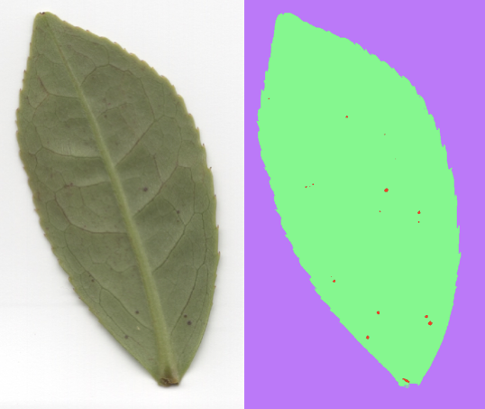
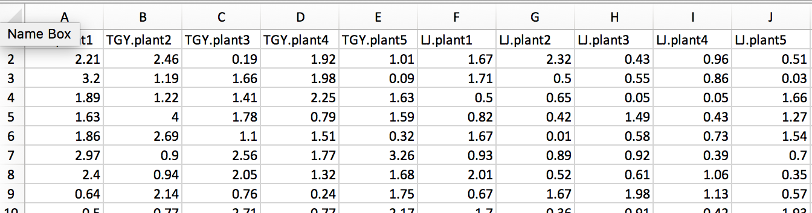
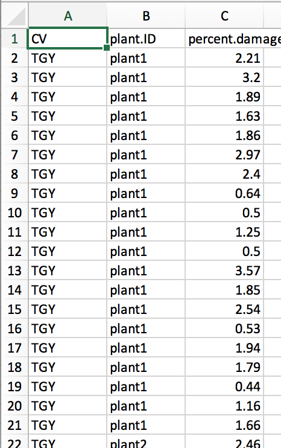
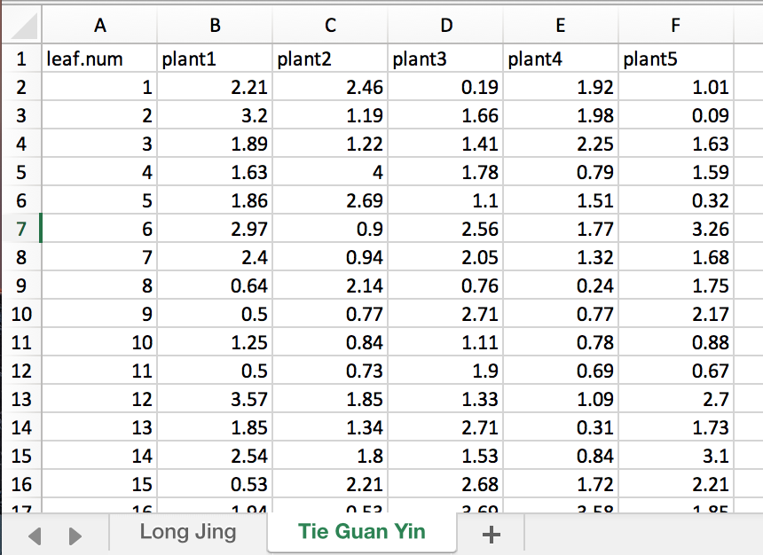

```{r include=FALSE}
library(tidyverse)
library(knitr)
library(cowplot)
theme_set(theme_gray())
```

## Setup for today

- Install the `tidyr` package
- Download `Example 1.csv` from Canvas
- Open a new notebook, save it, and load in these .csv files

```{r eval=FALSE}
# For example:
example1 <- read.csv("Example 1.csv")
```


## Overview
  
- More fun with `ggplot2`

- Tidying up your data

- One sample t-test

- Two sample t-test
    + x, y interface
    + formula interface
    
- Formulas in R

# Plotting comparisons of group means

## More fun with `ggplot2`

- Two-sample t-tests ask if two group means came from different distributions
- So, plots to go along with t-tests should show means and some measure of spread or distribution
- What plots have we learned so far that do this?

```{r include=FALSE}
p <- ggplot(sleep, aes(x = group, y = extra)) + labs(x = "Type of Sleep Drug", y = "Increase in Sleep (hrs)")
```

```{r include=FALSE}
# box plots
p.box <- p + geom_boxplot()
# violin plots
p.violin <- p + geom_violin(draw_quantiles = c(0.25, 0.5, 0.75))
# bar plots with error bars
p.bar <- p + stat_summary(geom = "bar", fun.y = mean) + stat_summary(geom = "errorbar", fun.data = mean_se, width = 0.25)
# scatter plots with jitter
p.jitter <- p + geom_jitter(width = 0.1, alpha = 0.5)
```

## More fun with `ggplot2`

```{r echo=FALSE}
plot_grid(p.box, p.violin, p.bar, p.jitter)
```

## Making bar plots better

- Bar plots on their own do a poor job of displaying data, even with error bars
- Adding the actual data points on top can improve them

## LIVE CODING

```{r echo=FALSE}
ggplot(chickwts, aes(x = feed, y = weight)) +
  stat_summary(geom = "bar", fun.y = mean) +
  stat_summary(geom = "errorbar", fun.data = mean_se, width = 0.25) +
  geom_jitter(width = 0.2, alpha = 0.5) +
  labs(x = "Feed Type", y = "Chick Weight (g)") + 
  theme(axis.text.x = element_text(angle = 45, hjust = 1))
```

## Ditch the bar!

- The height of the bar in a bar plot **just represents the mean**.
- Bar area can be **misleading** because it **doesn't** represent spread in any way.
- You *could* get rid of bars entirely and just plot means as a point!
- This is great for when your data values are not all > 0 and you have few data points.

## LIVE CODING

```{r echo=FALSE}
ggplot(chickwts, aes(x = feed, y = weight)) +
  geom_jitter(width = 0.2, alpha = 0.5) +
  stat_summary(geom = "point", fun.y = mean,
               shape = "square", color = "red", size = 3, alpha = 0.7) +
  stat_summary(geom = "errorbar", fun.data = mean_cl_normal,
               fun.args = list(conf.int = .95),
               color = "red", width = 0.2, alpha = 0.7)  + 
  labs(x = "Feed Type", y = "Chick Weight (g)") + 
  theme(axis.text.x = element_text(angle = 45, hjust = 1))
```

# Tidying up your data

```{r echo=FALSE, out.width="95%"}
knitr::include_graphics("tidy-1.png")
```

There are many ways to represent data, but only some are useful

## Data formats

- All the data we've given you so far has been *curated* to make it friendly
- There are many ways to record data---not always in the right format for R!

## Example 1:

You want to know if two common tea cultivars, Tie Guan Yin (TGY) and Long Jing (LJ), are equally susceptible to attack by the tea green leafhopper (*Empoasca onukii*).

```{r echo=FALSE, out.width="60%"}

```

## Example 1:

You randomly sample 5 plants of each cultivar and measure the amount of damage by collecting 20 leaves on each plant, scanning them, and using image analysis software to count the percentage of pixels with brown spots.

```{r echo=FALSE, out.width="50%"}

```

## Many possible data formats

There are many ways you might have recorded the data

```{r include=FALSE}
df1 <- tibble(TGY.plant1 = rnorm(20, 1.5, 1) %>% abs() %>% round(2),
              TGY.plant2 = rnorm(20, 1.5, 1) %>% abs() %>% round(2),
              TGY.plant3 = rnorm(20, 1.5, 1) %>% abs() %>% round(2),
              TGY.plant4 = rnorm(20, 1.5, 1) %>% abs() %>% round(2),
              TGY.plant5 = rnorm(20, 1.5, 1) %>% abs() %>% round(2),
              LJ.plant1 = rnorm(20, 0.5, 0.8) %>% abs() %>% round(2),
              LJ.plant2 = rnorm(20, 0.5, 0.8) %>% abs() %>% round(2),
              LJ.plant3 = rnorm(20, 0.5, 0.8) %>% abs() %>% round(2),
              LJ.plant4 = rnorm(20, 0.5, 0.8) %>% abs() %>% round(2),
              LJ.plant5 = rnorm(20, 0.5, 0.8) %>% abs() %>% round(2))

df.tidy <- df1 %>%
  gather(key = cv.plant, value = percent.damage) %>%
  separate(cv.plant, into = c("CV", "plant.ID"))

df2.TGY <- df.tidy %>%
  filter(CV == "TGY") %>%
  select(-CV) %>%
  group_by(plant.ID) %>% 
  mutate(leaf.num = 1:n()) %>% 
  spread(plant.ID, percent.damage)

df2.LJ <- df.tidy %>%
  filter(CV == "LJ") %>%
  select(-CV) %>%
  group_by(plant.ID) %>% 
  mutate(leaf.num = 1:n()) %>% 
  spread(plant.ID, percent.damage)
```

For example, with a separate column for every plant:

```{r echo=FALSE}

```

## Many possible data formats

Or with just three columns:

```{r echo=FALSE}

```

## Many possible data formats

Or using separate spreadsheets or pages for each cultivar:

```{r echo=FALSE}

```


## Tidy data

Not all of these data frames are easy to use in R.

TIDY DATA RULES:

1. Each variable (e.g. measurement, treatment) must have its own column
2. Each observation (e.g. individual) must have its own row
3. Each value must have its own cell

```{r echo=FALSE, out.width="95%"}
knitr::include_graphics("tidy-1.png")
```

## Why be tidy?

- R, specifically `dplyr` and `ggplot2`, are designed to work with tidy data
- It is good practice to have a consistent format for all your data frames

**BUT**

Sometimes data is **untidy** because:

  - It's convenient to enter it into a spreadsheet a different way
  - Someone who doesn't know R or tidy data gives it to you
  - An instrument outputs its data in an odd format
  - A particular type of data has a different convention for formatting
    
## Tidying untidy data

You *could* do it in Excel, but...

- It's easy to make errors
- It can be time-consuming (lots of copying and pasting!)
- It doesn't scale well (hard to do if you have thousands of rows)

- `tidyr` provides functions to do data tidying in R!

## Intro to data tidying

Step 1: figure out what the variables and observations are

```{r}
df1 <- read.csv("Example 1.csv")
head(df1, 3)
```

- How many variables? How many observations?

## Converting "wide" data to tidy data with `gather()`

- The column names in the previous slide represent *values*, **not** the names of variables
- `gather()` turns column names into a variable called `key` and values into a variable called `value`

```{r}
gather(df1) %>% head()
```

## Gathering

- Give the new columns names with `key = ` and `value = `

```{r}
df1.a <- df1 %>% 
  gather(key = "cultivar.plant", value = "percent_damage")

head(df1.a)
```

## Separating

- Better, but this still isn't tidy. Why?

```{r}
head(df1.a)
```


## Separating

- Our first column was two variables together.  Let's `separate()` them!

```{r}
df.fin <- df1.a %>%
  separate(cultivar.plant, into = c("cultivar", "plantID")) 

head(df.fin)
```

## Tidy yet?

- Now the data are tidy!
- Can I now use these data to do a t-test?  Why or why not?

```{r}
sample_n(df.fin, 6)
```


# Conducting t-tests with `t.test()`

## One-sample `t.test()`

- Is the distribution of `WolfTeeth` lengths from a population with a mean of 12 cm?

```{r message=FALSE, warning=FALSE, strip.white=TRUE, collapse=TRUE}
library(abd)
t.test(WolfTeeth$length, mu = 12)
```

- Displays $H_A$, $t$, degrees of freedom (df), and a p-value
- Hey, look at that! It also calculates a 95% confidence interval!

**Interpret the output to answer the biological question!**

## Two-sample `t.test()`

There are two ways to use `t.test()` to do a two-sample t-test

  1. "x, y" interface
  
```{r eval=FALSE, include=TRUE}
t.test(<<group 1 data>>, <<group 2 data>>, <<other arguments>>)
```
  
  2. "formula" interface

```{r eval=FALSE}
t.test(response_var ~ grouping_var,
       data = <<data frame object>>, <<other arguments>>)
```

## Tidy two-sample `t.test()`

- If your data are tidy, it will probably be easiest to use the **formula interface**.
- In R, formulas always have a "`~`" in them.
- These are **not** mathematical formulas, but a way of telling R how variables are related.

## Formulas in R

```{r}
my.formula <- percent.damage ~ cultivar
str(my.formula)
```
Read as "`percent.damage` as explained by `cultivar`" or "`percent.damage` distributed as `cultivar`"

## Tidy two-sample `t.test()`

`ToothGrowth` is a built-in, tidy dataset measuring the effect of vitamin C supplements on guinea pig tooth growth

```{r}
str(ToothGrowth)
```

## Tidy two-sample `t.test()`

Does the type of vitamin C supplement affect tooth length?

```{r}
t.test(len ~ supp, data = ToothGrowth)
```

What does this confidence interval mean?

## Un-tidy two-sample `t.test`

- Takes two vectors (and no `data=` argument)
- This way of using `t.test()` will also be important for paired t-tests (coming next week!)

```{r}
groupA <- rnorm(n = 10, mean = 1, sd = 1)
groupB <- rnorm(10, 1.3, 1)
```

```{r}
t.test(groupA, groupB)
```

## Un-tidy two-sample `t.test`

If you have an un-tidy data frame, you can use the `$` operator to access individual columns

```{r}
t.df <- data.frame(groupA, groupB)
head(t.df, 3)
```

```{r}
t.test(t.df$groupA, t.df$groupB)
```

## Equal and unequal variance t-tests

- By default, `t.test` assumes unequal variances.
- To do an equal variance t-test, add the argument `var.equal = TRUE`

```{r}
t.test(len ~ supp, data = ToothGrowth, var.equal = TRUE)
```

## Alternative hypotheses

- By default, the alternative hypothesis is that $\delta \neq 0$. You can change this with `mu = `
- Default is a two-tailed test, change with `alternative = "greater"` or `alternative = "less"`

- What hypothesis is this testing?

```{r}
t.test(len ~ supp, data = ToothGrowth,
       mu = 1,
       alternative = "greater")
```
